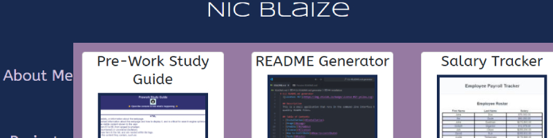

# React Portfolio
  

  ## Description
  This is my updated portfolio, written in React, which will help me to stand out from other developers whose portfolios don't use the latest technologies.

  ## Screenshot
   

  ## Table of Contents
  - [Installation](#installation)
  - [Usage](#usage)
  - [Credits](#credits)
  - [License](#license)
  - [How to Contribute](#how-to-contribute)
  - [Tests](#tests)
  - [Questions](#questions)

  ## Installation
  Go to the deployed link, provided here: [Netlify](https://nic-react-portfolio.netlify.app/)
  
  ## Usage
  Click on any of the links to see more information about me.

  ## Credits
  I used Ant Design 5.0 to help me design my page. Fonts are from Google. I also received a lot of help from classmates and TAs.

  ## License
  This project is licensed under the  [MIT](https://opensource.org/licenses/MIT) license.

  ## How to Contribute
  No contribution is desired at this time.

  ## Tests
  N/A

  ## Questions? 
  Contact me at
  [GitHub](https://github.com/k3strl), or email me at: <i.k3strl@gmail.com>